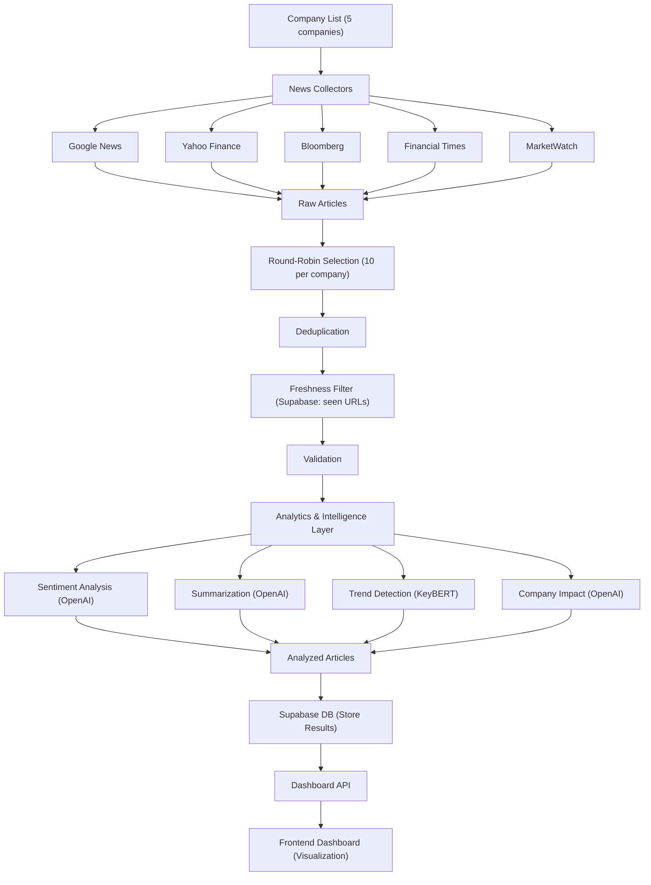

# Daily News Intelligence System

## Overview

This project is an automated, multi-source news intelligence system that tracks, analyzes, and visualizes daily news for the top 5 companies (Apple, Microsoft, Alphabet, Amazon, Tesla). It collects news from Google News, Yahoo Finance, Bloomberg, Financial Times, and MarketWatch, deduplicates and validates articles, analyzes them with AI (OpenAI + KeyBERT), and stores results in Supabase for dashboard visualization.

---

## Features
- **Multi-Source Collection:** Google News, Yahoo Finance, Bloomberg, Financial Times, MarketWatch
- **Company Management:** Tracks 5 major companies with aliases/tickers
- **Daily Automation:** Scheduled pipeline (APScheduler)
- **Deduplication & Freshness:** Avoids duplicates and only processes new articles
- **AI Analytics:** Sentiment, summarization, trend detection, company impact (OpenAI, KeyBERT)
- **Supabase Integration:** Stores articles, seen URLs, and analytics
- **Dashboard:** Flask + Chart.js frontend for interactive visualization
- **Error Handling & Logging:** Robust error recovery and debug logs

---

## Architecture



---

## Setup & Installation

### 1. Clone the Repository
```bash
git clone <repo-url>
cd ModoAI-project
```

### 2. Create and Activate Virtual Environment
```bash
python -m venv venv
source venv/bin/activate
```

### 3. Install Dependencies
```bash
pip install -r requirements.txt
```

### 4. Configure Environment Variables
Create a `.env` file in the project root with:
```
OPENAI_API_KEY=your_openai_key
SUPABASE_URL=your_supabase_url
SUPABASE_KEY=your_supabase_key
```

### 5. Set Up Supabase Tables
- `articles`: stores all analyzed articles
- `seen_urls`: stores URLs of already-processed articles

You can clear tables with SQL like:
```sql
DELETE FROM articles;
DELETE FROM seen_urls;
```

---

## Usage

### 1. Run the Pipeline (Manual)
```bash
python main.py
```
- This will collect, analyze, and store news for all 5 companies.

### 2. Run the Dashboard
```bash
python run_dashboard.py
```
- Visit [http://localhost:5001](http://localhost:5001) in your browser.
- Use the "Refresh Now" button to trigger news collection and update the dashboard.

### 3. Automated Scheduling
- The pipeline is scheduled to run daily at 7:00 AM by default (see `main.py`).

---

## Project Structure

```
ModoAI-project/
├── collectors/           # News source collectors (Google, Yahoo, Bloomberg, FT, MarketWatch)
├── companies/            # Company list and aliases
├── pipeline/             # Orchestrator, deduplication, validation
├── analytics/            # AI analytics (sentiment, summary, trends, impact)
├── db/                   # Supabase client
├── dashboard/            # Flask app and dashboard frontend
├── main.py               # Pipeline entrypoint (scheduled)
├── run_dashboard.py      # Dashboard runner
├── requirements.txt      # Python dependencies
└── .env                  # API keys and secrets
```

---

## Troubleshooting

- **No articles from some sources?**
  - Some RSS feeds (Bloomberg, FT, MarketWatch) may not always have company-specific news every day.
- **OpenAI quota errors?**
  - Check your OpenAI account and API key.
- **Supabase errors?**
  - Ensure your credentials are correct and tables exist.
- **Port 5001 in use?**
  - Change the port in `dashboard/app.py` and `run_dashboard.py`.
- **Stuck pipeline?**
  - Check logs for errors, especially in analytics (OpenAI rate limits, etc).

---

## Credits
- Built with Python, Supabase, OpenAI, LangChain, KeyBERT, Flask, Chart.js
- System design and implementation: [Your Name] 